<div align="center">


# 👋 Hi, I'm Salman Saeed


<br>

<a href="https://github.com/SalmanSaeed-1">

</a>

<a href="https://github.com/SalmanSaeed-1">

</a>

<a href="https://www.linkedin.com/in/salman-saeed-9421b536b/">

</a>

<a href="mailto:salmansaeedch008@gmail.com">

</a>

</div>

---

# 💫 About Me


🎓 **Bachelor of Science in Artificial Intelligence**  
**Ghulam Ishaq Khan Institute (GIKI)**  
**Expected Graduation:** 2029

---

I am an **Artificial Intelligence undergraduate** passionate about building intelligent systems through **Machine Learning**, **Python**, and **C++**.

My goal is to develop AI-powered applications that solve real-world problems while continuously improving my programming, analytical thinking, and software engineering skills.

Currently, I am focused on expanding my expertise in **Machine Learning**, strengthening my problem-solving abilities, and building meaningful projects that showcase practical AI applications.

---

## 🚀 Current Focus

- 🤖 Machine Learning
- 🐍 Python Programming
- 💻 C++ Development
- 📊 Data Science
- 🧠 Problem Solving
- 🚀 AI Projects
- 🏆 Competitive Programming

---

# 🛠️ Tech Stack

### Languages

<p align="center">


</p>

### Libraries

<p align="center">


</p>

### Tools

<p align="center">


</p>

---

# 📚 Currently Learning

```text
Machine Learning          ██████████░░░░░░ 60%

Python for AI             █████████████░░ 75%

Data Science              ████████░░░░░░░ 50%

Competitive Programming   ██████░░░░░░░░░ 40%

Git & GitHub              ███████████░░░░ 65%
```

---

> ### 💡 *"Building intelligent systems one project at a time."*

---

---


# 🚀 Featured Projects

<div align="center">

### Every project is a step towards becoming a better AI Engineer.

I enjoy building projects that strengthen my understanding of programming, software engineering, and artificial intelligence while solving practical problems.

</div>

<br>

## 🍔 Digital Food Ordering System


### 📖 Overview

A comprehensive **Object-Oriented Programming** project developed in **C++** that simulates a modern restaurant ordering system. The application demonstrates clean software architecture while implementing essential OOP concepts such as encapsulation, inheritance, abstraction, and modular programming.

### ✨ Features

- 🍽 Interactive restaurant ordering
- 📋 Smart menu management
- 🛒 Order management system
- 🧾 Automatic bill generation
- 💳 Payment simulation
- 💻 Console-based interface
- ⚙ Modular Object-Oriented Design

### 🛠 Technologies

<p>


</p>

### 🔗 Explore Repository

<p>

<a href="https://github.com/SalmanSaeed-1/CS-112-project-OOPS---Digital-food-ordering-system">


</a>

</p>

---

<br>

## 📈 Mathematical Solver & Graphing System


### 📖 Overview

A Python application developed to solve mathematical expressions while generating graphical visualizations of mathematical functions. The project combines computation and visualization to create an interactive mathematical toolkit.

### ✨ Features

- 📈 Function plotting
- 📉 Graph visualization
- 🔢 Mathematical calculations
- ⚡ Numerical computation
- 📊 Interactive graphs
- 🧮 Equation solving
- 🎨 User-friendly interface

### 🛠 Technologies

<p>


</p>

### 🔗 Explore Repository

<p>

<a href="https://github.com/SalmanSaeed-1/Mathematical-Solver-and-Graphing-System-Python-Programming-Project-">


</a>

</p>

---


# 📜 Certifications

<div align="center">

| 🎓 Certificate | 🏢 Issued By |
|:---------------|:-------------|
| 🤖 Google AI Essentials | Google |
| 🐍 Get Started with Python | Google |
| 🌐 Git & GitHub | Google |

</div>

---

# 🎯 Current Goals

<div align="center">

| Goal | Progress |
|:------|:--------:|
| 🤖 Machine Learning | ██████████░░ |
| 🚀 Build AI Projects | █████████░░░ |
| 💻 Competitive Programming | ███████░░░░ |
| 📚 Deep Learning | █████░░░░░░ |
| 🌍 Open Source Contribution | ████░░░░░░ |

</div>

---

# 🔥 GitHub Streak

<p align="center">


</p>

---

---
## 📊 GitHub Metrics

<p align="center">
  
</p>

---

# 📈 Contribution Graph

<p align="center">


</p>

---

## 🐍 My Contributions

<picture>
  <source
    media="(prefers-color-scheme: dark)"
    srcset="https://raw.githubusercontent.com/SalmanSaeed-1/SalmanSaeed-1/output/github-contribution-grid-snake-dark.svg"
  />
  <source
    media="(prefers-color-scheme: light)"
    srcset="https://raw.githubusercontent.com/SalmanSaeed-1/SalmanSaeed-1/output/github-contribution-grid-snake.svg"
  />
  
</picture>

# 🌟 My Development Journey

```text
2025 ─────────────── Learned C++ & OOP
        │
        ├── Python Programming
        │
        ├── Google AI Essentials
        │
2026 ───┼── Machine Learning
        │
        ├── AI Projects
        │
        ├── Competitive Programming
        │
        ▼
Future ─ Become an AI Engineer
```

---

# 🤝 Let's Connect

<p align="center">

<a href="https://github.com/SalmanSaeed-1">

</a>

<a href="https://www.linkedin.com/in/salman-saeed-9421b536b/">

</a>

<a href="mailto:salmansaeedch008@gmail.com">

</a>

</p>

---

# 💬 Quote

<div align="center">

### 💡 "Success isn't about knowing everything. It's about never stopping the pursuit of knowledge."

</div>

---

<div align="center">

## ⭐ Thank You for Visiting My Profile!

If you like my projects, consider giving them a ⭐ on GitHub.

I am always open to collaborating on **Artificial Intelligence**, **Machine Learning**, and **Open Source** projects.

<br>


</div>
